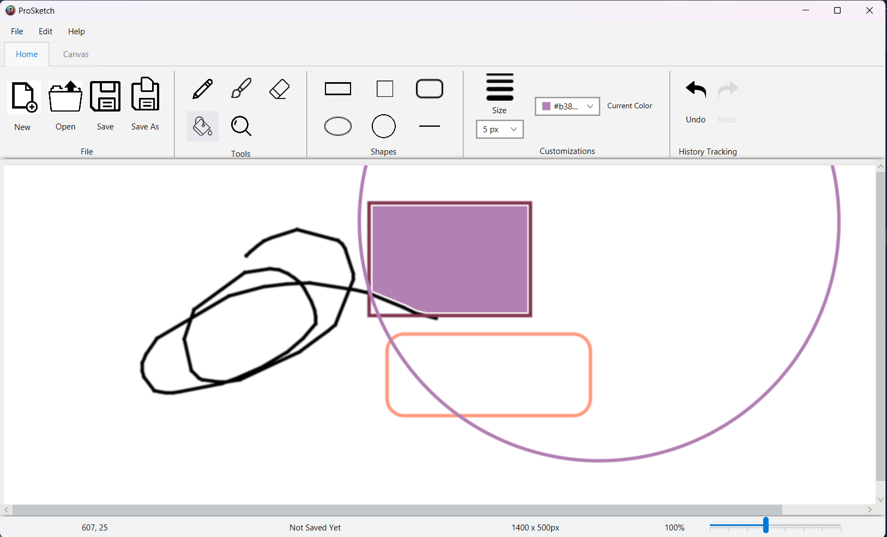

# ProSketch
## ProSketch là một ứng dụng được dùng cho việc **vẽ**, **chỉnh sửa ảnh** tương tự như MSPaint. 

## Author: [Bùi Thái Sỹ](https://github.com/sybui2004)   

## Drawing Tools:
**Pencil**, **Brush**, **Eraser**, **Color Picker**, **Filler**.
## Shapes:
**Rectangle**, **Round Rectangle**, **Oval**, **Line**, **Rectangle**, **Square**.
##  Features:
**Canvas zoom and drag**,**open/save file**, **undo/redo**, **canvas resize**, **Escape to discard current drawing**.
## Demo Video: [Video demo]()

## Demo Picture: 

## UML:

## Getting Started

- Setup JDK
- Clone this folder
- Run file ProSketch/project/src/main/java/app/view/DrawingApp.java
